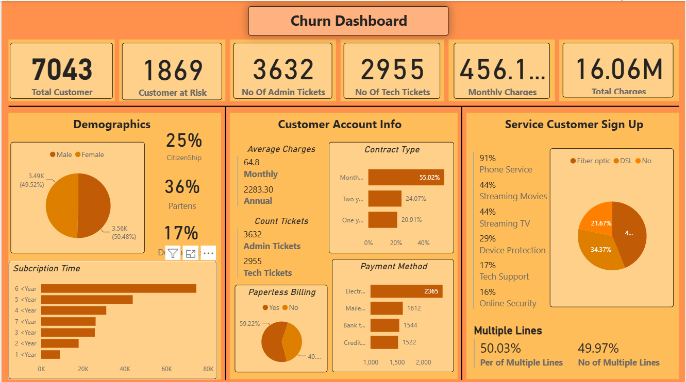
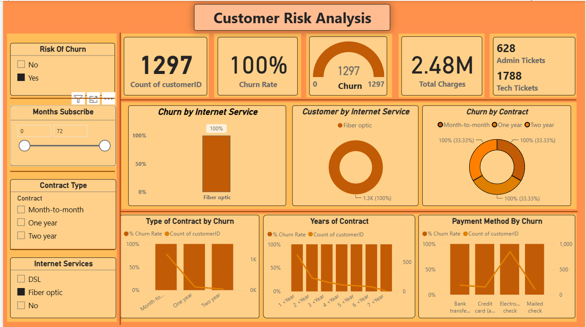

# 📊 Customer Churn Analysis Dashboard

## 📌 Project Overview

This project presents an interactive **Customer Churn Analysis Dashboard** built using **Power BI**. The dashboard helps identify customer churn patterns, analyze customer behavior, and provide actionable business insights through interactive visualizations.

The goal of this project is to help businesses understand the key factors influencing customer churn and support data-driven decision-making to improve customer retention.

---

## 🛠️ Tools & Technologies

- Power BI
- Microsoft Excel
- Power Query
- DAX
- Data Visualization

---

## 📂 Dataset

The dataset contains customer demographic information, account details, subscribed services, billing information, and churn status.

Key attributes include:

- Customer ID
- Gender
- Senior Citizen
- Partner & Dependents
- Contract Type
- Internet Service
- Payment Method
- Monthly Charges
- Total Charges
- Customer Churn

---

## 📈 Dashboard Preview

### Customer Churn Dashboard



### Customer Risk Analysis Dashboard



---

## 📊 Dashboard Highlights

- Customer Overview
- Churn Risk Monitoring
- Monthly & Total Revenue
- Customer Demographics
- Contract Type Analysis
- Payment Method Analysis
- Internet Service Insights
- Customer Support Ticket Analysis
- Interactive Filters & Slicers

---

## 💡 Key Business Insights

- Customers with **month-to-month contracts** have the highest churn rate.
- **Fiber Optic** users are more likely to leave compared to other internet service users.
- Customers using **Electronic Check** as a payment method show higher churn.
- Long-term contracts improve customer retention.
- Customer demographics and subscribed services significantly influence churn behavior.

---

## 🎯 Project Objectives

- Analyze customer churn patterns.
- Monitor important business KPIs.
- Identify high-risk customers.
- Support strategic business decisions.
- Present insights using an interactive Power BI dashboard.

---

## 📁 Repository Structure

```
Customer-Churn-Analysis-Dashboard/
│
├── Customer-Churn-Analysis.pbix
├── Churn-Dataset.xlsx
├── Dashboard1.png
├── Dashboard2.png
└── README.md
```

---

## 🚀 Future Improvements

- Predict customer churn using Machine Learning.
- Add customer segmentation analysis.
- Include profitability analysis.
- Create executive summary dashboards.
- Automate data refresh using Power BI Service.

---

## 👩‍💻 Author

**Soujanya Hanamanth Giraddi**

📧 Email: soujanyareddy9380@gmail.com.com

⭐ If you found this project useful, feel free to star the repository.
